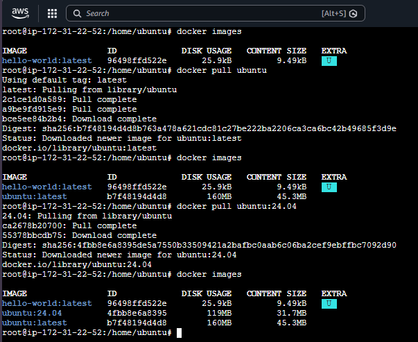
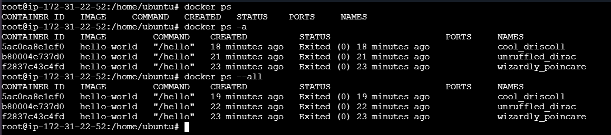

# 17 - Basic Docker Commands

In this section, I learned some of the most commonly used Docker commands. These commands help me inspect Docker, download images, and view images or containers on my system.

---





# 1. `docker version` / `docker -v`

## What does it do?

Displays the installed Docker version.

- `docker version` shows both **Client** and **Server (Docker Engine)** versions.
- `docker -v` (or `docker --version`) only prints the installed Docker version.

## Syntax

```bash
docker version
docker -v
```

## Examples

```bash
docker version
```

```bash
docker -v
```

## Remember

- Use this command to verify Docker is installed.
- `docker version` gives more detailed information than `docker -v`.

---

# 2. `docker info`

## What does it do?

Displays detailed information about the Docker Engine.

It shows information such as:

- Number of containers
- Number of images
- Storage Driver
- Logging Driver
- CPU
- Memory
- Docker Root Directory
- Operating System
- Docker Version

## Syntax

```bash
docker info
```

## Example

```bash
docker info
```

## Remember

- Useful for troubleshooting Docker.
- Gives complete information about the Docker daemon and host.

---

# 3. `docker pull`

## What does it do?

Downloads a Docker image from a Docker Registry.

By default, Docker downloads images from **Docker Hub**.

If no tag is specified, Docker automatically downloads the **latest** version.

---

## Syntax

```bash
docker pull IMAGE[:TAG]
```

or

```bash
docker pull [OPTIONS] IMAGE[:TAG|@DIGEST]
```

---

## Examples

### Download the latest Ubuntu image

```bash
docker pull ubuntu
```

Docker automatically uses:

```text
ubuntu:latest
```

---

### Download a specific version

```bash
docker pull ubuntu:24.04
```

Downloads only Ubuntu version **24.04**.

---

### Download all available tags

```bash
docker pull --all-tags ubuntu
```

Downloads all available versions (tags) of the Ubuntu image.

---

## What I observed

Initially I had only one image.

```text
hello-world:latest
```

After running

```bash
docker pull ubuntu
```

Docker downloaded

```text
ubuntu:latest
```

Then I downloaded another version.

```bash
docker pull ubuntu:24.04
```

Now my system contains both images.

```text
ubuntu:latest
ubuntu:24.04
```

This means Docker can store multiple versions of the same image simultaneously.

---

## Remember

- Images are downloaded only once and stored locally.
- If the image already exists locally, Docker won't download it again.
- If no tag is given, Docker assumes **latest**.

---

# 4. `docker images`

## What does it do?

Lists all Docker images stored on the local machine.

It displays:

- Repository Name
- Tag
- Image ID
- Size
- Other metadata

---

## Syntax

```bash
docker images
```

---

### Show only Image IDs

```bash
docker images -q
```

---

## Examples

```bash
docker images
```

Output may look like

```text
hello-world:latest
ubuntu:latest
ubuntu:24.04
```

---

```bash
docker images -q
```

Output

```text
96498ffd522e
b7f48194d4d8
4fbb8e6a8395
```

Only Image IDs are displayed.

---

## Remember

- Shows only **local images**.
- It does **not** download anything.
- Useful before creating containers.

---

# 5. `docker ps`

## What does it do?

Lists Docker containers.

By default, it only shows **currently running containers**.

It displays information like:

- Container ID
- Image
- Command
- Status
- Ports
- Container Name

---

## Syntax

```bash
docker ps
```

---

### Show all containers

```bash
docker ps -a
```

or

```bash
docker ps --all
```

---

## Examples

### Running containers only

```bash
docker ps
```

If nothing is running, the output will be empty.

---

### Show all containers

```bash
docker ps -a
```

Example output

```text
hello-world
Exited (0)
cool_driscoll
```

This also displays stopped containers.

---

## What I observed

Running

```bash
docker ps
```

returned no output because there were no running containers.

But

```bash
docker ps -a
```

showed all previously created **hello-world** containers with status:

```text
Exited (0)
```

This means the containers were created successfully, executed their task, and then stopped.

---

## Remember

- `docker ps` → Running containers only.
- `docker ps -a` → Running + Stopped containers.
- Very useful while debugging Docker containers.

---

# Quick Revision

| Command | Purpose |
|----------|---------|
| `docker version` | Shows Docker Client & Server version |
| `docker -v` | Shows Docker version only |
| `docker info` | Displays Docker Engine information |
| `docker pull ubuntu` | Downloads the latest Ubuntu image |
| `docker pull ubuntu:24.04` | Downloads Ubuntu 24.04 image |
| `docker pull --all-tags ubuntu` | Downloads all Ubuntu image tags |
| `docker images` | Lists all local Docker images |
| `docker images -q` | Lists only Image IDs |
| `docker ps` | Shows running containers |
| `docker ps -a` | Shows all containers (running + stopped) |

